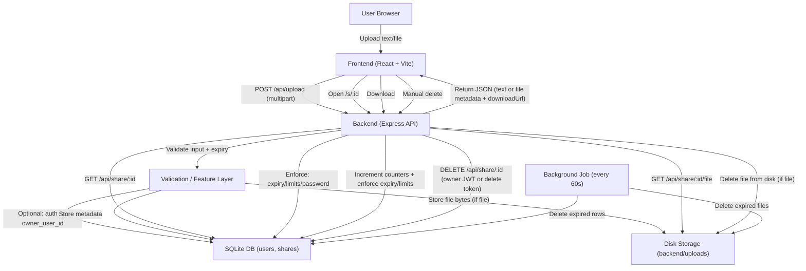
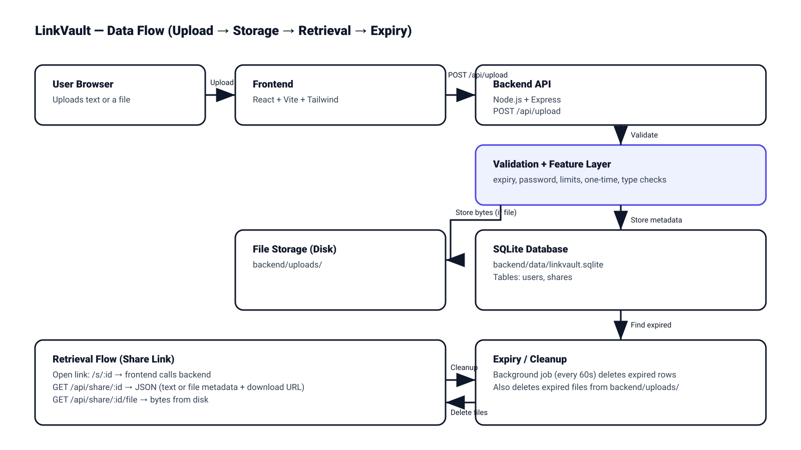

# LinkVault

Full-stack web application for securely sharing **either text or a file** via a generated link. Content is accessible only with the exact link and is automatically deleted after expiry.

## Repository Structure

- `frontend/`  
  React + Vite + Tailwind CSS (UI)
- `backend/`  
  Node.js + Express.js (REST API)
- `backend/src/db.js`  
  SQLite schema + queries

---

## Setup Instructions

### 1) Prerequisites

- Node.js `v18.x`
- npm `v10.x`

If you are using `nvm` (recommended):

```bash
# install nvm
curl -o- https://raw.githubusercontent.com/nvm-sh/nvm/v0.40.3/install.sh | bash

# in lieu of restarting the shell
\. "$HOME/.nvm/nvm.sh"

# install Node 18
nvm install 18

node -v
npm -v
```

### 2) Backend

```bash
cd backend
npm install
npm run dev
```

Backend runs on:

- `http://localhost:8080`

Environment variables (optional) are documented in:

- `backend/.env.example`

### 3) Frontend

```bash
cd frontend
npm install
npm run dev
```

Frontend runs on:

- `http://localhost:5173`

The frontend calls the backend at `http://localhost:8080` by default.

---

## API Overview

Base URL (dev): `http://localhost:8080`

All responses are JSON unless otherwise specified.

When `FEATURE_AUTH=1`, authenticated requests use:

- Header: `Authorization: Bearer <jwt>`

### Health

- `GET /health` -> `{ ok: true }`

### Feature flags

- `GET /api/features`

Returns a JSON object indicating which optional features are enabled on the backend:

```json
{
  "auth": true,
  "password": true,
  "oneTime": true,
  "limits": true,
  "manualDelete": true,
  "fileTypeValidation": true
}
```

### Upload

- `POST /api/upload` (multipart/form-data)
  - Exactly one of:
    - `text` (string)
    - `file` (file)
  - Optional:
    - `expiresAt` (ISO datetime string)
    - `password` (string) (only used when `FEATURE_PASSWORD=1`)
    - `oneTime` (`true|false`) (only used when `FEATURE_ONE_TIME=1`)
    - `maxViews` (number) (only used when `FEATURE_LIMITS=1`)
    - `maxDownloads` (number) (only used when `FEATURE_LIMITS=1`)

Returns `201`:

```json
{ "id": "...", "kind": "text|file", "expiresAt": 1234567890, "deleteToken": "..." }
```

Notes:

- If `FEATURE_AUTH=1` and a valid JWT is included, the share is saved with `owner_user_id`.
- If `FEATURE_FILE_TYPE_VALIDATION=1` and `ALLOWED_MIME_TYPES` is set, file uploads not matching the allowlist return `415`.
- Files are stored on disk under `backend/uploads/`.

### Retrieve share metadata/content

- `GET /api/share/:id`
  - If invalid/expired: returns `403`
  - If password feature enabled and share is protected: `401` unless header is provided

If password-protected:

- Header: `x-share-password: <password>`

If share is a text share, response includes the text.

If share is a file share, response includes `downloadUrl`.

Example (text share):

```json
{
  "id": "...",
  "kind": "text",
  "text": "...",
  "createdAt": 1700000000000,
  "expiresAt": 1700000600000
}
```

Example (file share):

```json
{
  "id": "...",
  "kind": "file",
  "originalFilename": "example.pdf",
  "mimeType": "application/pdf",
  "byteSize": 12345,
  "createdAt": 1700000000000,
  "expiresAt": 1700000600000,
  "downloadUrl": "/api/share/.../file"
}
```

### Download file

- `GET /api/share/:id/file`
  - If invalid/expired: returns `403`

If password-protected:

- Header: `x-share-password: <password>`

Returns the raw file download.

### Manual delete (optional)

- `DELETE /api/share/:id`

Used only when `FEATURE_MANUAL_DELETE=1`.

Deletion rules:

- If the share was created while logged in (has `owner_user_id`):
  - Requires `Authorization: Bearer <jwt>`
  - Only the owner can delete
- If the share was created while logged out (no `owner_user_id`):
  - Requires header `x-delete-token: <token>`

Common errors:

- `401` with `{ "error": "Login required to delete this share." }` for owned shares when logged out
- `403` with `{ "error": "Not allowed to delete this share." }` when logged in as a different user
- `401` with `{ "error": "Delete token required." }` for anonymous shares when no token is provided
- `401` with `{ "error": "Invalid delete token." }` for anonymous shares when token is wrong

---

## Optional Features (Feature-Flagged)

The backend supports optional features that can be independently enabled/disabled via env flags:

- `FEATURE_AUTH`
- `FEATURE_PASSWORD`
- `FEATURE_ONE_TIME`
- `FEATURE_LIMITS`
- `FEATURE_MANUAL_DELETE`
- `FEATURE_FILE_TYPE_VALIDATION`

The frontend reads active flags from:

- `GET /api/features`

### Auth (optional)

- `POST /api/auth/register` -> returns JWT
- `POST /api/auth/login` -> returns JWT
- `GET /api/auth/me` -> returns current user (requires `Authorization: Bearer <token>`)

If `FEATURE_AUTH=0`, these endpoints return `404`.

The frontend stores the JWT in `sessionStorage` (tab-scoped). Opening a share link in a new tab will not automatically be logged in.

### Password-protected shares (optional)

If `FEATURE_PASSWORD=1` and a share has a password set, access requires:

- Header: `x-share-password: <password>`

### One-time links / view/download limits (optional)

- One-time: share is deleted after first successful view/download
- Limits: max views/downloads enforced

### Manual delete (optional)

- `DELETE /api/share/:id`
  - If the share was created while logged in (has `owner_user_id`):
    - Login is required and only the owner JWT can delete.
    - Delete tokens are ignored for owned shares.
  - If the share was created while logged out (no `owner_user_id`):
    - Header `x-delete-token: <token>` is required.

UI behavior:

- Shared link pages (`/s/:id`) show a **Login to delete** link when logged out (auth enabled). After login/register, the app redirects back to the same share page.

### File type validation (optional)

- Controlled by `ALLOWED_MIME_TYPES` and `FEATURE_FILE_TYPE_VALIDATION`

---

## Database Schema / Model Definitions (SQLite)

SQLite is used via `better-sqlite3`.

DB file location (runtime, not committed to git):

- `backend/data/linkvault.sqlite`

Storage layout:

- Files are stored on disk: `backend/uploads/<stored_filename>`
- File metadata and all text content are stored in SQLite

### Table: `users`

| Column | Type | Notes |
|---|---:|---|
| `id` | INTEGER | Primary key, autoincrement |
| `username` | TEXT | Unique |
| `password_hash` | TEXT | bcrypt hash |
| `created_at` | INTEGER | epoch ms |

Notes:

- Passwords are never stored in plaintext.
- `username` is unique.

### Table: `shares`

| Column | Type | Notes |
|---|---:|---|
| `id` | TEXT | Primary key (public share id) |
| `kind` | TEXT | `text` or `file` |
| `text_content` | TEXT | present for text shares |
| `original_filename` | TEXT | present for file shares |
| `stored_filename` | TEXT | actual filename stored under `backend/uploads/` |
| `mime_type` | TEXT | file mime type |
| `byte_size` | INTEGER | size |
| `created_at` | INTEGER | epoch ms |
| `expires_at` | INTEGER | epoch ms |
| `owner_user_id` | INTEGER | nullable (only when auth feature used) |
| `password_hash` | TEXT | nullable (password-protected shares) |
| `one_time` | INTEGER | `0/1` |
| `max_views` | INTEGER | nullable |
| `max_downloads` | INTEGER | nullable |
| `view_count` | INTEGER | increments on `GET /api/share/:id` |
| `download_count` | INTEGER | increments on `GET /api/share/:id/file` |
| `delete_token_hash` | TEXT | bcrypt hash of delete token |

Notes:

- `id` is generated via `nanoid` and is treated as unguessable.
- `kind` is constrained to `text` or `file`.
- Expiry is enforced at read time and by a background cleanup job.
- `idx_shares_expires_at` index is used to efficiently find expired shares.
- `delete_token_hash` is compared via bcrypt when deleting anonymous shares.
- Columns are added via lightweight migrations (`PRAGMA table_info` + `ALTER TABLE`) at startup.

---

## Design Decisions

- **SQLite** for simple local persistence.
  - Easy to run locally for a take-home project.
  - No external services required.
- **Files stored on disk**, metadata in DB.
  - Binary file bytes are stored in `backend/uploads/`.
  - SQLite stores metadata (`stored_filename`, `mime_type`, `byte_size`, etc.).
  - Text shares store the text directly in SQLite (`text_content`).
- **Expiry enforcement**.
  - Expired rows are removed by:
    - A background cleanup loop (every 60 seconds)
    - A cleanup call on retrieval endpoints (best-effort)
  - Expired file shares also remove the corresponding file from disk.
- **Security model (base)**.
  - Knowledge of the random share `id` is the primary access mechanism.
  - Responses avoid differentiating "not found" vs "expired" (both return `403 Invalid or expired link.`).
- **Optional features are feature-flagged**.
  - Optional behavior is isolated in `backend/src/features/*` and enabled by env flags.
  - Frontend reads feature availability from `GET /api/features` to show/hide UI.
- **Auth UX**.
  - JWT is stored in `sessionStorage` (tab-only) so opening share links in new tabs does not automatically sign you in.
  - Share pages show a login call-to-action when auth is enabled.

---

## Assumptions and Limitations

- This is a take-home/demo style app; not production hardened.
- Default CORS allows only `FRONTEND_ORIGIN`.
- Password protection is implemented via bcrypt hash comparison and a custom header (`x-share-password`).
- Share IDs are random, but no rate limiting / brute-force protection is included.
- No email verification / password resets.
- Tokens are stored in `sessionStorage` (tab-scoped) for the demo UX; closing the tab logs you out.
- Manual delete is intentionally strict for owned shares:
  - If `owner_user_id` exists, only the owner JWT can delete (delete token is ignored).
- No HTTPS enforcement (intended for local dev).
- No CSRF protection (JWT is stored in `sessionStorage` and sent via `Authorization` header).
- File type validation is allowlist-based only when configured.

---

## Data Flow Diagram (High-Level)




